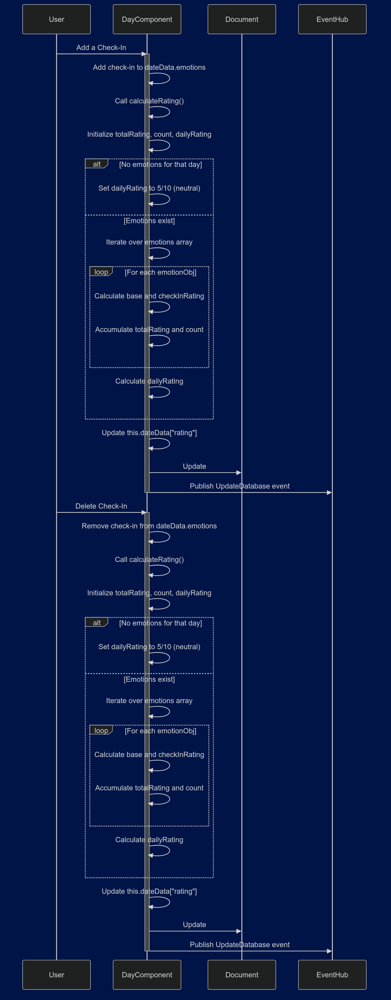

The Day Rating feature automatically calculates a daily rating for the user by averaging all of their check-in scores. 
  - Each time a user checks in, a check-in score is calculated using the emotion chosen and the selected magnitude of that emotion.
  - Each emotion holds a numeric value in descending order, with "Happy" being the most positive, and "Disgusted" being most negative. This base value is multiplied by the selected magnitude to get the final rating value for that check-in.
  - Each time a user adds or deletes a check-in, the calculateRating() method is called to re-calculate the rating for that day, store the rating in the dailyRating object, and then update all of the pages with that data using the eventhub.
  - The day rating is constantly updated and displayed on the day page to give the user a number rating for their day. 

