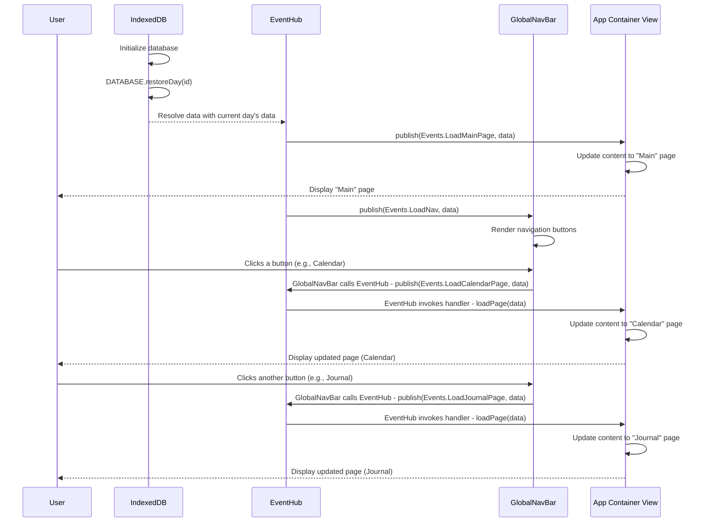

## Global Navigation Menu

The global navigation menu is a feature that allows users to navigate between different pages of the application. It is a common component that is present on all pages of the application and provides a consistent way for users to switch between different pages of the app.

